# Wordpress
## Установка WordPress
1.  Скачиваем файлы CMS WordPress с официального сайта <a href = "https://ru.wordpress.org/download/">https://ru.wordpress.org/</a>
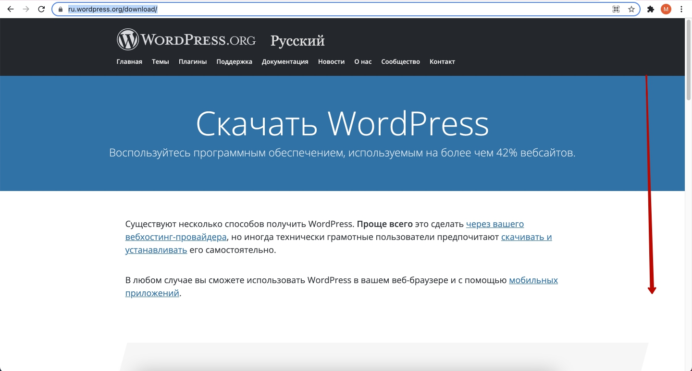  
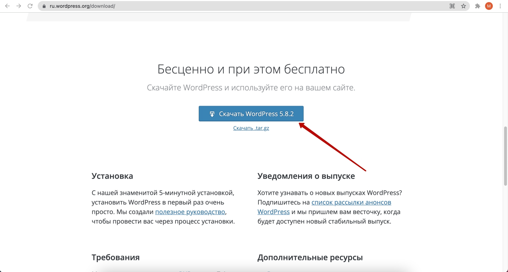  
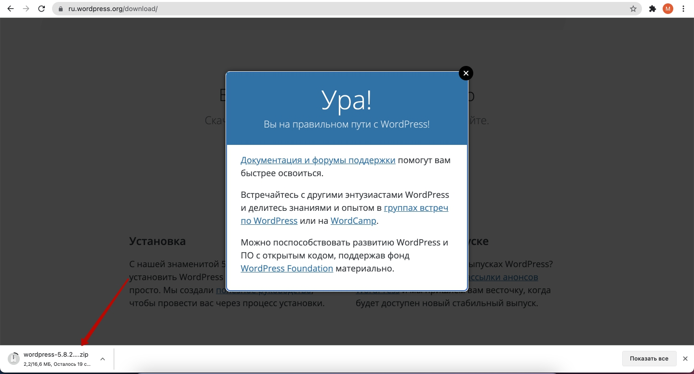  

2.  Создаем место, где будет установлен WordPress, например покупаем хостинг на <a href = "https://www.ukraine.com.ua/?page=99770">Ukraine.com.ua</a>
3.  Подключаемся к файлам хостинга. Для этого используем подключение по FTP: *адрес хоста*, *логин*, *пароль* . Для заргузки используем FTP-клиент (рекомендуется <a href = "https://www.ghisler.com/download.htm">Total Commander</a> для Windows, <a href = "https://filezilla-project.org/">FileZilla</a> - для Windows, Mac)

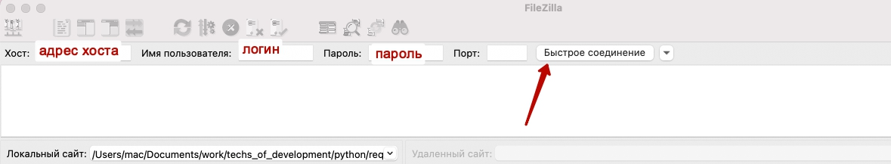  
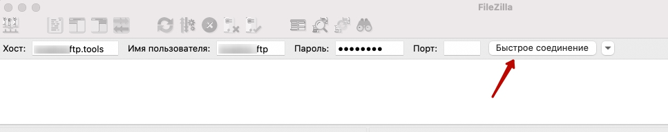  

4. Создаем папку на локальном компьютере.  
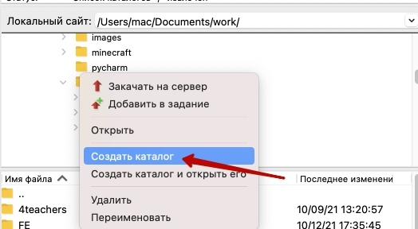   
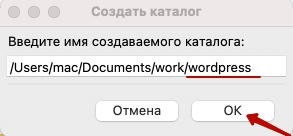   
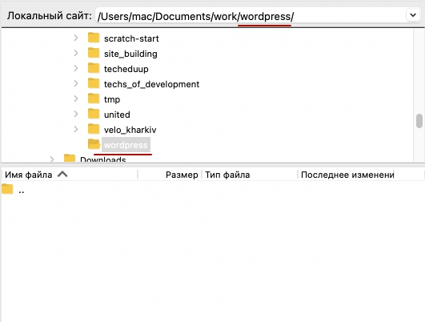   

5. Создаем папку на хостинге  
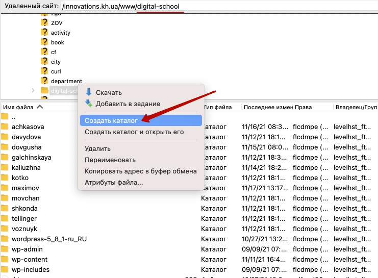  
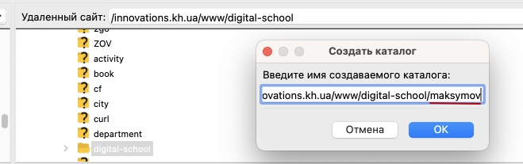  

6. Переносим скачанный архив CMS в папку на компьютере  
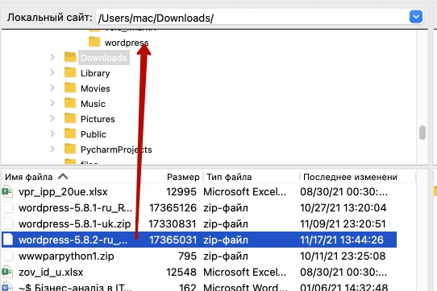  

7. Загружаем на хостинг (одновременно должна быть открыта папка на локальном компьютере и на хостинге)  
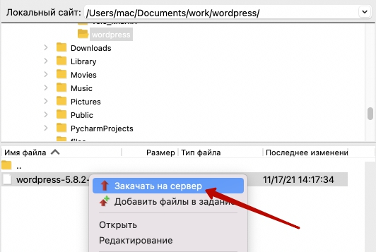    

8. Заходим на хостинг (в файловый менеджер). Распаковываем загруженный архив:  
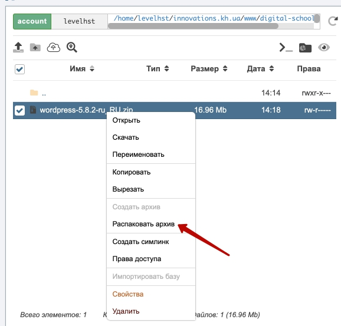    
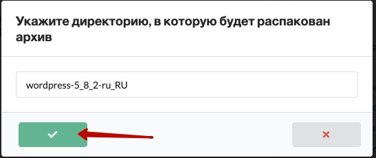   

9. Заходим в созданную папку  
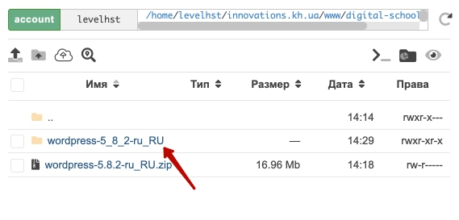   
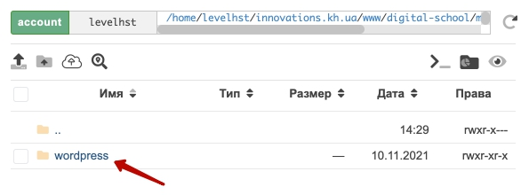  

10. Выделим файлы, нажмем правую клавишу и выберем пункт "Вырезать"  
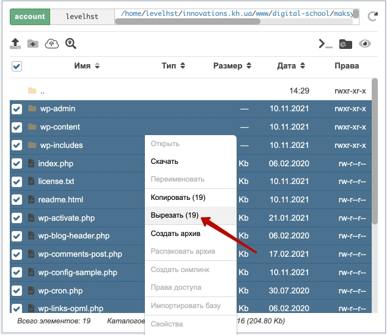  

11. Выйдем на уровень вверх  
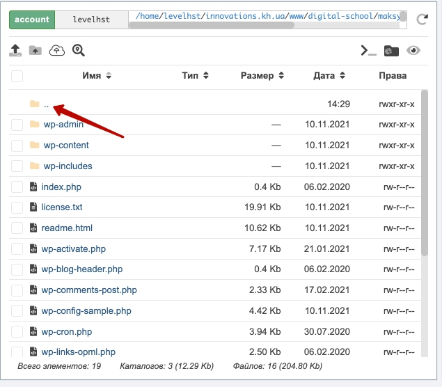  
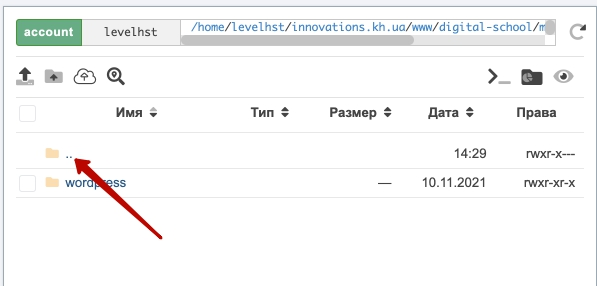  

12. Нажмем правой клавишей на свободном месте в папке. Выберем пункт "Вставить".  
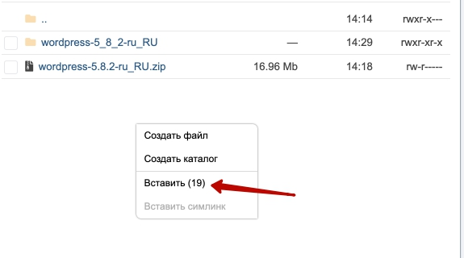  

13. В результате получим файлы в нужной папке:  
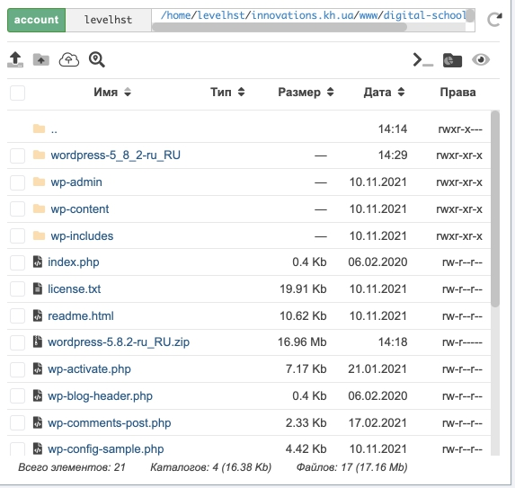  

14. Заходим по веб-адресу 
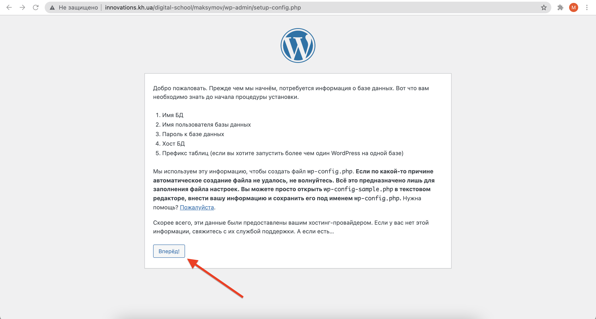  
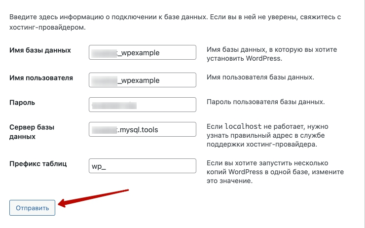  
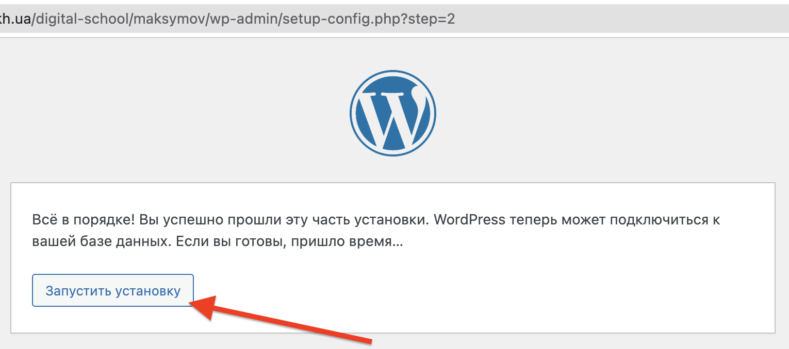  
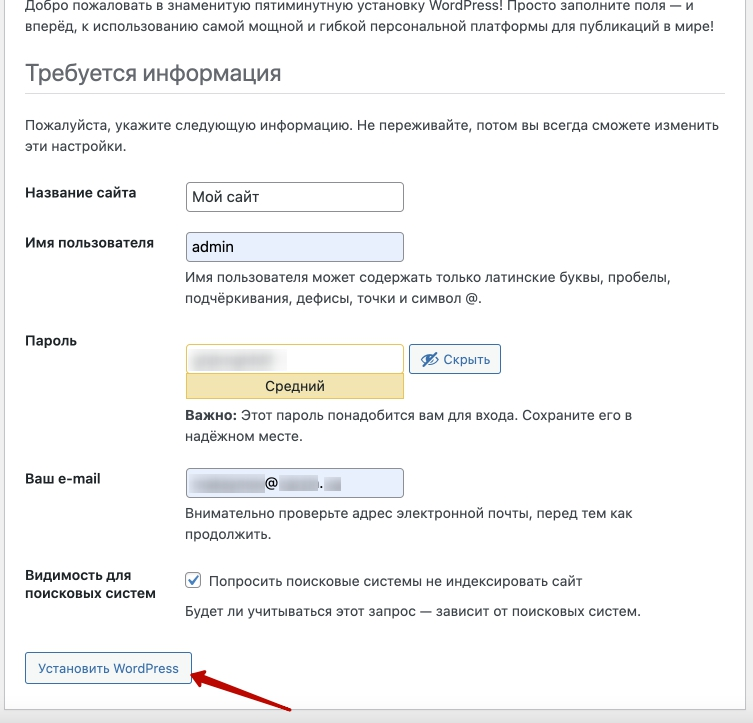  
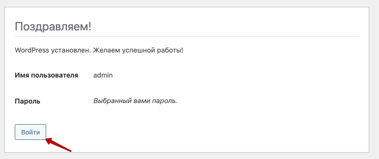  
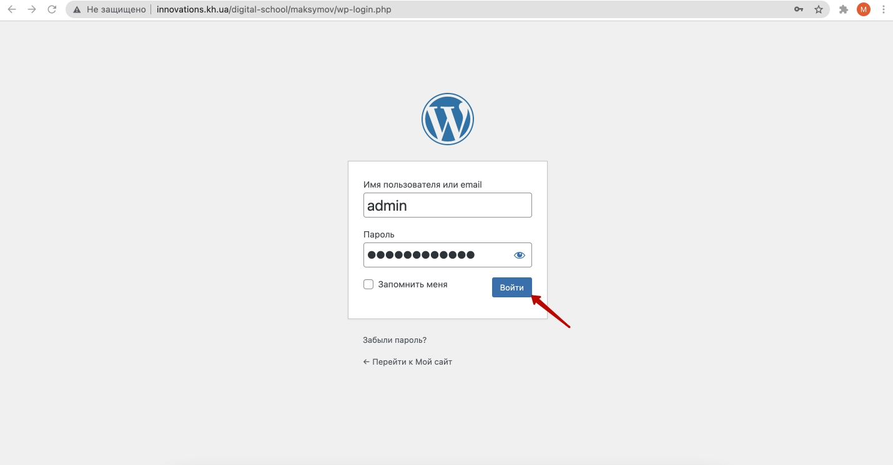  
