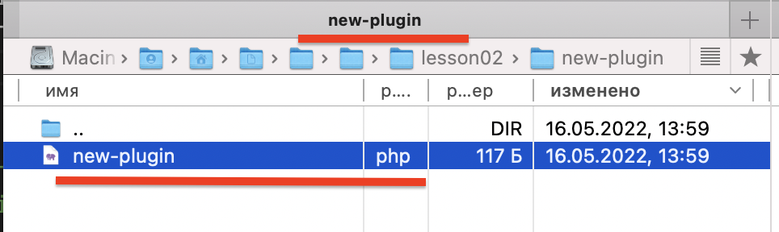

# Створення плагіну під WordPress
Плагіни - це функціональні частини WordPress, які дозволяють формувати користувацький функціонал.
## Створення плагіну під WordPress
Для того, щоб створити плагін під WordPress необхідно створити папку із іменем плагіну, а також в даній папці створити файл ім'ям, яке відповідає назві плагіну.
Наприклад, для створення плагіну **new-plugin.php**
```php
<?php
/**
 * Plugin Name: Новий плагін
 * Description: Опис плагіну (140 символів)
```




```php
<?php

/**
 * Plugin Name: Назва плагіну
 * Description: Опис плагіну (140 символів)
 * Plugin URI:  Посилання на сторінку плагіну
 * Author URI:  Посилання на автора
 * Author:      Ім'я автора
 * Version:     Версія плагіну, наприклад 1.0
 *
 * Text Domain: ID перекладу, що вказується в load_plugin_textdomain()
 * Domain Path: Шлях до файлу переводу.
 * Requires at least: 2.5
 * Requires PHP: 5.4
 *
 * License:     GPL2
 * License URI: https://www.gnu.org/licenses/gpl-2.0.html
 *
 * Network:     Вкажіть "true" для можливості активувати плагін для мережі Multisite.
 * Update URI: https://site.ru/link_to_update
 */

// код плагіну
```